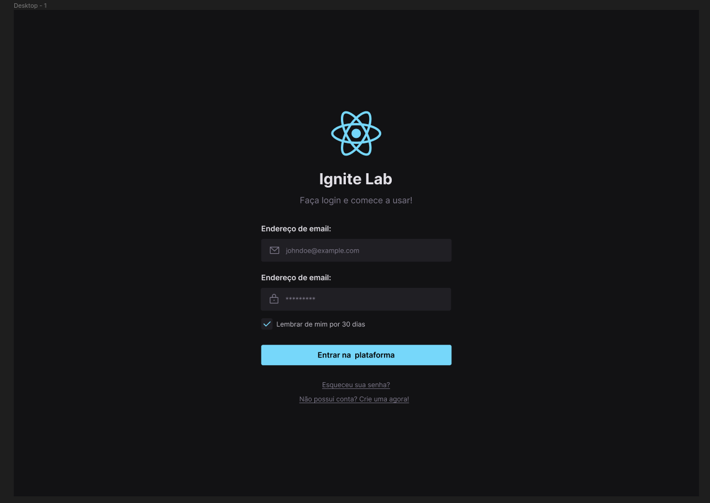
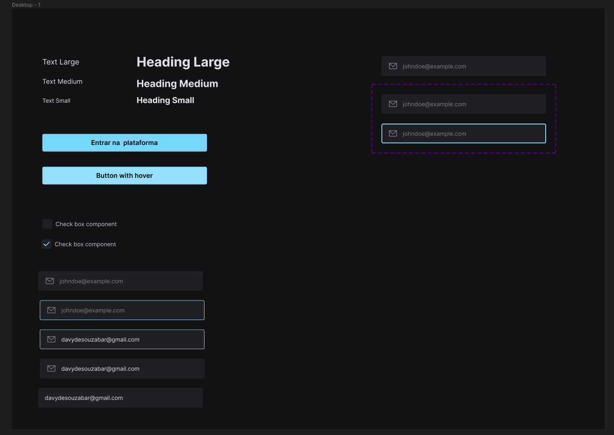
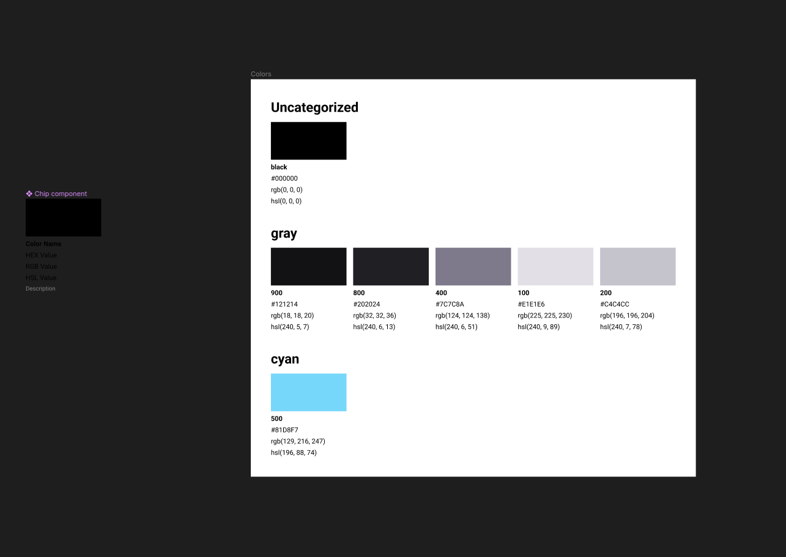

# react-design-system

<p align="center">
 
 
 
</p>

## 💻 Project

This project is intended to be a simple design system. I decided to do this project to study both component documentation and some Figma features.

- [x] Components
- [x] Components documentation
- [x] Design

## ✨ Tecnologias

- [x] Figma
- [x] React
- [x] Typescript
- [x] Vite
- [x] Storybook
- [x] Radix UI
- [x] Storybook
- [x] Tailwind
- [x] clsx
- [x] Postcss
- [x] Phosphor-react

## :hammer_and_wrench: Running project

```bash
# Install the dependencies
$ yarn

# Start Storybook
$ yarn storybook
```

<p align="center">Made with ❤️ by Davy de Souza</p>
